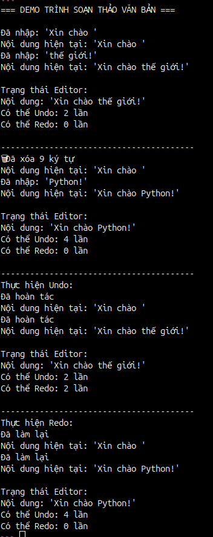
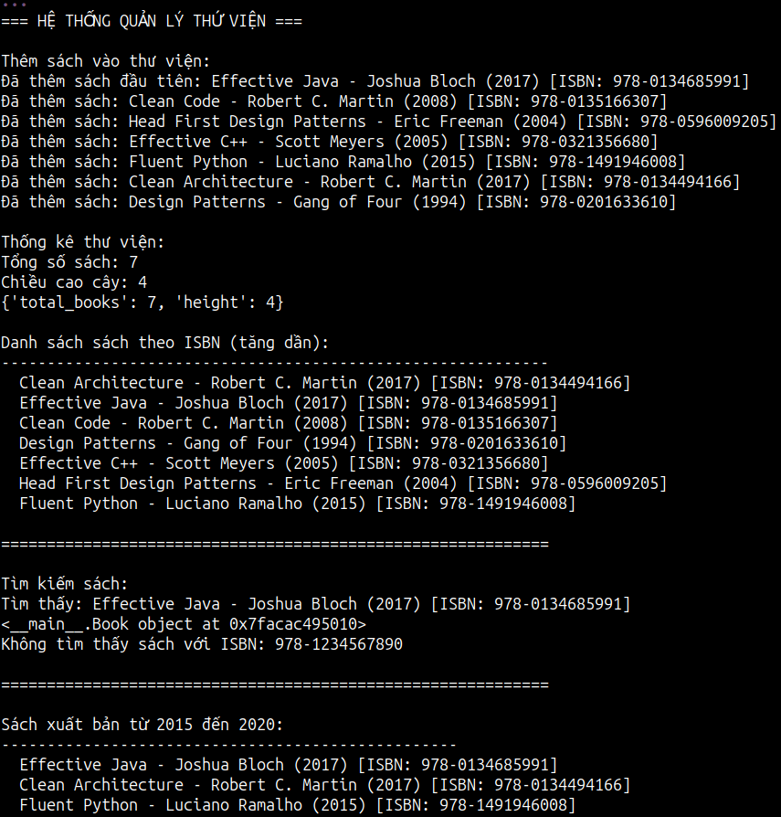

# Cấu trúc dữ liệu queue, stack và binary search tree

Trong lập trình, việc lựa chọn cấu trúc dữ liệu phù hợp là chìa khóa để tạo ra những ứng dụng hiệu quả và tối ưu. Hôm nay chúng ta sẽ cùng tìm hiểu ba cấu trúc dữ liệu cơ bản nhưng vô cùng quan trọng: Queue, Stack và Binary Search Tree, kèm theo những ví dụ ứng dụng thực tiễn bằng Python.

---

## 1. Queue (Hàng đợi)

### Khái niệm cơ bản

Queue là một cấu trúc dữ liệu hoạt động theo nguyên tắc FIFO (First In, First Out) - phần tử được thêm vào trước sẽ được lấy ra trước. Giống như hàng đợi trong đời thực, người đến trước sẽ được phục vụ trước.

**Các thao tác cơ bản:**
- **Enqueue**: Thêm phần tử vào cuối hàng đợi
- **Dequeue**: Lấy phần tử từ đầu hàng đợi
- **Front**: Xem phần tử đầu hàng đợi
- **IsEmpty**: Kiểm tra hàng đợi có rỗng không

### Code ứng dụng: Hệ thống xử lý đơn hàng của cửa hàng online

```python
from collections import deque
from datetime import datetime
import time

class Order:
    def __init__(self, order_id, customer_name, items, total_amount):
        self.order_id = order_id
        self.customer_name = customer_name
        self.items = items
        self.total_amount = total_amount
        self.timestamp = datetime.now()
    
    def __str__(self):
        return f"Đơn hàng #{self.order_id} - {self.customer_name} - {self.total_amount}đ"

class OrderProcessingSystem:
    def __init__(self):
        self.order_queue = deque()
        self.processing = False
    
    def add_order(self, order):
        """Thêm đơn hàng vào hàng đợi"""
        self.order_queue.append(order)
        print(f"Đã thêm {order} vào hàng đợi")
        print(f"Số đơn hàng đang chờ: {len(self.order_queue)}")
    
    def process_next_order(self):
        """Xử lý đơn hàng tiếp theo"""
        if not self.order_queue:
            print("Không có đơn hàng nào để xử lý")
            return None
        
        order = self.order_queue.popleft()
        print(f"Đang xử lý {order}")
        
        # Giả lập thời gian xử lý
        time.sleep(1)
        
        print(f"Đã xử lý xong {order}")
        return order
    
    def get_queue_status(self):
        """Xem trạng thái hàng đợi"""
        print(f"\nTrạng thái hàng đợi:")
        print(f"Số đơn hàng đang chờ: {len(self.order_queue)}")
        if self.order_queue:
            print("Đơn hàng tiếp theo:", self.order_queue[0])

# Kiểm tra hoạt động
if __name__ == "__main__":
    # Tạo hệ thống xử lý đơn hàng
    system = OrderProcessingSystem()
    
    # Thêm một số đơn hàng
    orders = [
        Order(1001, "Nguyễn Văn A", ["iPhone 15", "Case"], 25000000),
        Order(1002, "Trần Thị B", ["MacBook Air", "Mouse"], 30000000),
        Order(1003, "Lê Văn C", ["iPad Pro", "Pencil"], 28000000),
    ]
    
    # Thêm đơn hàng vào hàng đợi
    for order in orders:
        system.add_order(order)
    
    print("\n" + "="*50)
    
    # Xử lý từng đơn hàng
    while system.order_queue:
        system.get_queue_status()
        system.process_next_order()
        print("-" * 30)
```
### Kết quả


## 2. Stack (Ngăn xếp)

### Khái niệm cơ bản

Stack là cấu trúc dữ liệu hoạt động theo nguyên tắc LIFO (Last In, First Out) - phần tử được thêm vào sau cùng sẽ được lấy ra trước. Giống như một chồng đĩa, ta chỉ có thể lấy đĩa từ trên cùng.

**Các thao tác cơ bản:**
- **Push**: Đẩy phần tử lên đỉnh stack
- **Pop**: Lấy phần tử từ đỉnh stack
- **Top/Peek**: Xem phần tử đỉnh stack
- **IsEmpty**: Kiểm tra stack có rỗng không

### Code ứng dụng: Tính năng Undo/Redo trong trình soạn thảo văn bản

```python
class TextEditor:
    def __init__(self):
        self.content = ""
        self.undo_stack = []
        self.redo_stack = []
    
    def type_text(self, text):
        """Nhập văn bản mới"""
        # Lưu trạng thái hiện tại vào undo stack
        self.undo_stack.append(self.content)
        self.content += text
        
        # Clear redo stack khi có thao tác mới
        self.redo_stack.clear()
        
        print(f"Đã nhập: '{text}'")
        print(f"Nội dung hiện tại: '{self.content}'")
    
    def delete_chars(self, num_chars):
        """Xóa ký tự"""
        if num_chars > len(self.content):
            num_chars = len(self.content)
        
        # Lưu trạng thái hiện tại
        self.undo_stack.append(self.content)
        self.content = self.content[:-num_chars]
        
        # Clear redo stack
        self.redo_stack.clear()
        
        print(f"🗑Đã xóa {num_chars} ký tự")
        print(f"Nội dung hiện tại: '{self.content}'")
    
    def undo(self):
        """Hoàn tác thao tác cuối"""
        if not self.undo_stack:
            print("Không thể hoàn tác thêm")
            return
        
        # Lưu trạng thái hiện tại vào redo stack
        self.redo_stack.append(self.content)
        
        # Khôi phục trạng thái trước đó
        self.content = self.undo_stack.pop()
        
        print(f"Đã hoàn tác")
        print(f"Nội dung hiện tại: '{self.content}'")
    
    def redo(self):
        """Làm lại thao tác đã hoàn tác"""
        if not self.redo_stack:
            print("Không thể làm lại thêm")
            return
        
        # Lưu trạng thái hiện tại vào undo stack
        self.undo_stack.append(self.content)
        
        # Khôi phục trạng thái đã hoàn tác
        self.content = self.redo_stack.pop()
        
        print(f"Đã làm lại")
        print(f"Nội dung hiện tại: '{self.content}'")
    
    def get_status(self):
        """Hiển thị trạng thái editor"""
        print(f"\nTrạng thái Editor:")
        print(f"Nội dung: '{self.content}'")
        print(f"Có thể Undo: {len(self.undo_stack)} lần")
        print(f"Có thể Redo: {len(self.redo_stack)} lần")

# Kiểm tra hoạt động
if __name__ == "__main__":
    editor = TextEditor()
    
    # Thử nghiệm các thao tác
    print("=== DEMO TRÌNH SOẠN THẢO VĂN BẢN ===\n")
    
    editor.type_text("Xin chào ")
    editor.type_text("thế giới!")
    editor.get_status()
    
    print("\n" + "-"*40)
    editor.delete_chars(9)  # Xóa "thế giới!"
    editor.type_text("Python!")
    editor.get_status()
    
    print("\n" + "-"*40)
    print("Thực hiện Undo:")
    editor.undo()  # Hoàn tác việc thêm "Python!"
    editor.undo()  # Hoàn tác việc xóa "thế giới!"
    editor.get_status()
    
    print("\n" + "-"*40)
    print("Thực hiện Redo:")
    editor.redo()  # Làm lại việc xóa
    editor.redo()  # Làm lại việc thêm "Python!"
    editor.get_status()
```

### Kết quả



## 3. Binary Search Tree (Cây tìm kiếm nhị phân)

### Khái niệm cơ bản

Binary Search Tree (BST) là một cây nhị phân đặc biệt trong đó:
- Mỗi node có tối đa 2 con (trái và phải)
- Tất cả các node con bên trái có giá trị nhỏ hơn node cha
- Tất cả các node con bên phải có giá trị lớn hơn node cha
- Cả cây con trái và phải đều là BST

**Ưu điểm:**
- Tìm kiếm, thêm, xóa có độ phức tạp O(log n) trong trường hợp tốt
- Duyệt theo thứ tự tăng dần rất dễ dàng

### Code ứng dụng: Hệ thống quản lý thư viện sách

```python
class Book:
    def __init__(self, isbn, title, author, year):
        self.isbn = isbn
        self.title = title
        self.author = author
        self.year = year
    
    def __str__(self):
        return f"{self.title} - {self.author} ({self.year}) [ISBN: {self.isbn}]"

class TreeNode:
    def __init__(self, book):
        self.book = book
        self.left = None
        self.right = None

class LibraryBST:
    def __init__(self):
        self.root = None
    
    def insert(self, book):
        """Thêm sách vào thư viện"""
        if self.root is None:
            self.root = TreeNode(book)
            print(f"Đã thêm sách đầu tiên: {book}")
        else:
            self._insert_recursive(self.root, book)
    
    def _insert_recursive(self, node, book):
        """Thêm sách đệ quy"""
        if book.isbn < node.book.isbn:
            if node.left is None:
                node.left = TreeNode(book)
                print(f"Đã thêm sách: {book}")
            else:
                self._insert_recursive(node.left, book)
        elif book.isbn > node.book.isbn:
            if node.right is None:
                node.right = TreeNode(book)
                print(f"Đã thêm sách: {book}")
            else:
                self._insert_recursive(node.right, book)
        else:
            print(f"Sách với ISBN {book.isbn} đã tồn tại")
    
    def search(self, isbn):
        """Tìm kiếm sách theo ISBN"""
        result = self._search_recursive(self.root, isbn)
        if result:
            print(f"Tìm thấy: {result.book}")
            return result.book
        else:
            print(f"Không tìm thấy sách với ISBN: {isbn}")
            return None
    
    def _search_recursive(self, node, isbn):
        """Tìm kiếm đệ quy"""
        if node is None or node.book.isbn == isbn:
            return node
        
        if isbn < node.book.isbn:
            return self._search_recursive(node.left, isbn)
        else:
            return self._search_recursive(node.right, isbn)
    
    def inorder_traversal(self):
        """Duyệt cây theo thứ tự tăng dần (ISBN)"""
        print("\nDanh sách sách theo ISBN (tăng dần):")
        print("-" * 60)
        self._inorder_recursive(self.root)
    
    def _inorder_recursive(self, node):
        """Duyệt cây đệ quy"""
        if node:
            self._inorder_recursive(node.left)
            print(f"  {node.book}")
            self._inorder_recursive(node.right)
    
    def find_books_by_year_range(self, start_year, end_year):
        """Tìm sách trong khoảng năm xuất bản"""
        print(f"\nSách xuất bản từ {start_year} đến {end_year}:")
        print("-" * 50)
        books = []
        self._find_by_year_recursive(self.root, start_year, end_year, books)
        
        if books:
            for book in books:
                print(f"  {book}")
        else:
            print("  Không tìm thấy sách nào trong khoảng thời gian này")
        
        return books
    
    def _find_by_year_recursive(self, node, start_year, end_year, books):
        """Tìm sách theo năm đệ quy"""
        if node:
            if start_year <= node.book.year <= end_year:
                books.append(node.book)
            
            self._find_by_year_recursive(node.left, start_year, end_year, books)
            self._find_by_year_recursive(node.right, start_year, end_year, books)
    
    def get_statistics(self):
        """Thống kê thư viện"""
        total_books = self._count_nodes(self.root)
        height = self._get_height(self.root)
        
        print(f"\nThống kê thư viện:")
        print(f"Tổng số sách: {total_books}")
        print(f"Chiều cao cây: {height}")
        
        return {"total_books": total_books, "height": height}
    
    def _count_nodes(self, node):
        """Đếm số node trong cây"""
        if node is None:
            return 0
        return 1 + self._count_nodes(node.left) + self._count_nodes(node.right)
    
    def _get_height(self, node):
        """Tính chiều cao cây"""
        if node is None:
            return -1
        return 1 + max(self._get_height(node.left), self._get_height(node.right))

# Kiểm tra hoạt động
if __name__ == "__main__":
    # Tạo thư viện
    library = LibraryBST()
    
    print("=== HỆ THỐNG QUẢN LÝ THỨ VIỆN ===\n")
    
    # Thêm sách vào thư viện
    books = [
        Book("978-0134685991", "Effective Java", "Joshua Bloch", 2017),
        Book("978-0135166307", "Clean Code", "Robert C. Martin", 2008),
        Book("978-0596009205", "Head First Design Patterns", "Eric Freeman", 2004),
        Book("978-0321356680", "Effective C++", "Scott Meyers", 2005),
        Book("978-1491946008", "Fluent Python", "Luciano Ramalho", 2015),
        Book("978-0134494166", "Clean Architecture", "Robert C. Martin", 2017),
        Book("978-0201633610", "Design Patterns", "Gang of Four", 1994),
    ]
    
    print("Thêm sách vào thư viện:")
    for book in books:
        library.insert(book)
    
    # Hiển thị thống kê
    library.get_statistics()
    
    # Hiển thị tất cả sách theo thứ tự ISBN
    library.inorder_traversal()
    
    print("\n" + "="*60)
    
    # Tìm kiếm sách
    print("\nTìm kiếm sách:")
    library.search("978-0134685991")  # Tìm thấy
    library.search("978-1234567890")  # Không tìm thấy
    
    print("\n" + "="*60)
    
    # Tìm sách theo năm xuất bản
    library.find_books_by_year_range(2015, 2020)
```

### Kết quả 


