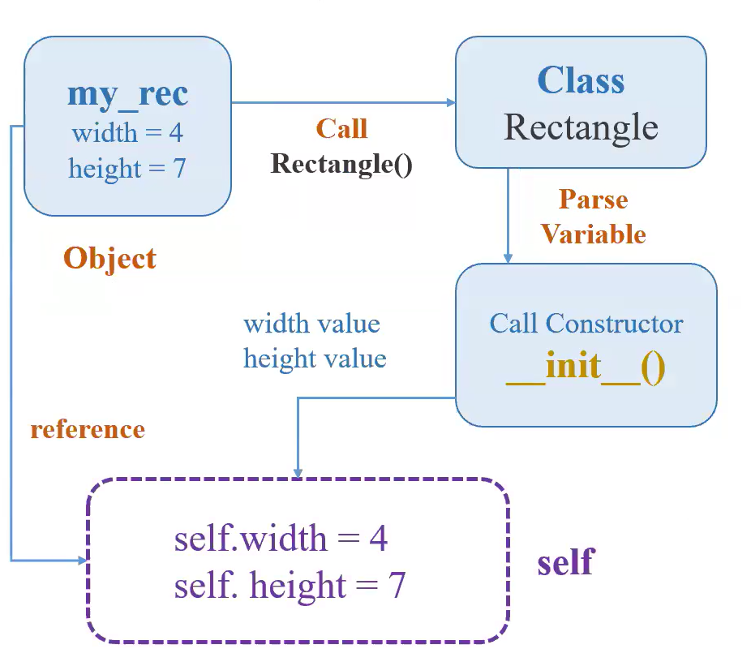

# OOP - Classes and Objects

## OOP: Object-Oriented Programming

- **OOP (Object-Oriented Programming)** là một phương pháp lập trình tập trung vào việc tạo ra các "đối tượng" (objects) để đại diện cho các thực thể trong thế giới thực hoặc các khái niệm trừu tượng. Các đối tượng này sẽ có **thuộc tính** (dữ liệu) và **hành vi** (các hàm/phương thức).
    - **Class (Lớp):** Là **khuôn mẫu, bản thiết kế** chung. Nó định nghĩa những đặc điểm (thuộc tính) và những việc có thể làm (hành vi) cho một loại đối tượng nào đó.
    - **Constructor** : `__init__()`: là một hàm **Tự động được gọi:** Mỗi khi bạn "tạo mới" một đối tượng (Object) từ một Class. **Khởi tạo (initialize) các thuộc tính:** Dùng để gán các giá trị ban đầu cho các `attributes` (thuộc tính) của đối tượng vừa được tạo.
    - **Object (Đối tượng):** Là **sản phẩm cụ thể, một thể hiện** được tạo ra từ Class. Mỗi object sẽ có các thuộc tính riêng (ví dụ: ngôi nhà số 1 có màu sơn xanh, ngôi nhà số 2 có màu sơn đỏ) nhưng vẫn tuân theo khuôn mẫu của Class.
    - **Class `ConMeo`**: Bản thiết kế cho tất cả các con mèo.
        - **Thuộc tính:** `mauLong`, `canNang`, `soChan`.
        - **Hành vi:** `keu()`, `chay()`, `ngu()`.
    - **Object `MeoTamThe`**: Một đối tượng cụ thể được tạo từ Class `ConMeo` bao gồm các **attributes** và **methods**.
        - **Thuộc tính (attributes) : là những đặc điểm, thông tin của object**
            - `mauLong = "tam the"`, `canNang = 4kg`, `soChan = 4`.
        - **Hành vi (methods) : những hành động mà object có thể thực hiện**
            - `MeoTamThe.keu()` (sẽ phát ra tiếng "meo meo").
---
## Cấu trúc cơ bản của một class :

> **Class → Constructor → Objects → attributes → methods**



```python
class Rectangle:
    def __init__(self, my_width, my_height):
        self.width = my_width
        self.height = my_height

    def calculate_area(self):
        self.area = self.width * self.height
        return self.area

    def calculate_perimeter(self):
        return (self.width + self.height) * 2

my_rec = Rectangle(4, 7)
```
**Instance** (thể hiện/đối tượng): Đây là một thuật ngữ trong OOP. Một instance (thể hiện) là một bản thể cụ thể, riêng lẻ của một lớp (class). Khi bạn định nghĩa một class (ví dụ Animal), bạn đang tạo một "khuôn mẫu" hoặc "bản thiết kế". Khi bạn tạo một object (đối tượng) từ class đó, bạn đang tạo ra một "bản sao" cụ thể dựa trên khuôn mẫu đó. Bản sao cụ thể đó chính là một instance.

Ở đây **my_rec** là một instance

Phương thức __call__: Khi bạn định nghĩa phương thức __call__ trong một lớp, và sau đó tạo một đối tượng từ lớp đó, bạn có thể "gọi" đối tượng đó bằng cách sử dụng dấu ngoặc đơn () như thể nó là một hàm. Khi bạn làm như vậy, Python sẽ tự động gọi phương thức __call__ của đối tượng đó.

```python
class MyClass:
    def __init__(self, value):
        self.value = value
        print("Đối tượng được tạo.")

    def __call__(self, *args, **kwargs):
        print(f"Đối tượng đã được gọi! Giá trị của đối tượng: {self.value}")
        print(f"Các đối số truyền vào: {args}")
        print(f"Các đối số từ khóa truyền vào: {kwargs}")
        # Bạn có thể thêm logic xử lý tại đây
        return "Kết quả từ __call__"

# Tạo một đối tượng từ lớp MyClass
my_object = MyClass(10)

# Gọi đối tượng như một hàm
result = my_object(1, 2, name="Alice")

print(result)
# Output:
# Đối tượng được tạo # Kết quả tạo ra từ constructor
# Đối tượng đã được gọi! Giá trị của đối tượng: 10
# Các đối số truyền vào: (1, 2) # *args sẽ trả về các đối số dưới dạng tuple
# Các đối số từ khóa truyền vào: {"name": "Alice"} # **args sẽ trả về các đối số dưới dạng dict 
```
Tác dung của __call__: đầu tiên vẫn gán object với class để gọi constructor, sau đó, gán trực tiếp biến đó với giá trị như một function đã được định nghĩa thay vì phải gọi như methods

**`Không có __call__`**
```python
class MyClass:
	def __init__(self, name):
		self.name = name
	def my_name(self):
		print(f"Hello {self.name}")
obj1 = MyClass("Phong")
obj1.my_name()
```
**`Có __call__`**
```python
class MyClass:
	def __init__(self, name):
		self.name = name
	def __call__(self):
		print(f"Hello {self.name}")
obj2 = MyClass("Phong")
obj2()
```
***args: (Arguments - Đối số vị trí) :"Số lượng đối số vị trí không xác định"**

Hãy tưởng tượng bạn gọi điện đặt bánh pizza. Người bán hàng sẽ hỏi bạn muốn chọn những **loại topping nào**.

- Bạn có thể nói: "Cho tôi **thịt xông khói**, **nấm**, **ớt chuông**."
- Hoặc bạn có thể nói: "Tôi chỉ muốn **phô mai** thôi."
- Hoặc: "Cho tôi **thịt gà**, **dứa**, **hành tây**, **ô liu**."

Bạn thấy đó, bạn có thể nói bao nhiêu loại topping tùy ý, không có giới hạn! Người bán hàng chỉ cần nghe một danh sách các loại topping theo thứ tự bạn nói, không cần bạn phải nói "topping 1 là...", "topping 2 là...".

Trong lập trình, đó chính là ý nghĩa của "số lượng đối số vị trí không xác định":

- Bạn có thể truyền vào 1, 2, 3, hay 1000 giá trị.
- Các giá trị này được nhận diện dựa vào **vị trí** của chúng trong danh sách bạn đưa ra.
 ```python
def dat_topping_pizza(*danh_sach_topping): # Dấu * ở đây là "hãy gom tất cả các loại topping tôi nói vào một danh sách"
    print("Bạn đã chọn các topping sau:")
    for topping in danh_sach_topping:
        print(f"- {topping}")

# Gọi hàm
dat_topping_pizza("thịt xông khói", "nấm", "ớt chuông")
# Output:
# Bạn đã chọn các topping sau:
# - thịt xông khói
# - - nấm
# - ớt chuông

dat_topping_pizza("phô mai")
# Output:
# Bạn đã chọn các topping sau:
# - phô mai
```
****args:  "Số lượng đối số từ khóa không xác định”**

Bây giờ, vẫn là đặt bánh pizza, nhưng lần này bạn muốn chỉ rõ các **yêu cầu đặc biệt** cho bánh.

- Bạn có thể nói: "Cho tôi bánh **kích_cỡ=lớn**, **loại_đế=mỏng**, **phô_mai_thêm=Đúng**."
- Hoặc bạn có thể nói: "Tôi muốn bánh **khuyến_mãi=sinh_nhật**."
- Hoặc: "Chỉ cần bánh **giao_hàng_tại=nhà** thôi."

Lần này, bạn không chỉ nói giá trị (ví dụ "lớn"), mà bạn còn nói rõ đó là "kích cỡ" gì (`kích_cỡ=lớn`). Mỗi yêu cầu đều có một **tên rõ ràng** đi kèm với giá trị của nó. Bạn cũng có thể đưa ra bao nhiêu yêu cầu đặc biệt tùy thích, miễn là mỗi yêu cầu đều có tên.

Trong lập trình, đó chính là ý nghĩa của "số lượng đối số từ khóa không xác định":

- Bạn có thể truyền vào 1, 2, 3, hay 1000 cặp "tên = giá trị".
- Các giá trị này được nhận diện dựa vào **tên (từ khóa)** mà bạn đặt cho chúng.
```python
def dat_yeu_cau_dac_biet_pizza(**thong_tin_them): # Dấu ** ở đây là "hãy gom tất cả các yêu cầu có tên vào một danh sách các yêu cầu"
    print("Các yêu cầu đặc biệt của bạn:")
    for yeu_cau, chi_tiet in thong_tin_them.items():
        print(f"- {yeu_cau}: {chi_tiet}")

# Gọi hàm
dat_yeu_cau_dac_biet_pizza(kích_cỡ="lớn", loại_đế="mỏng", phô_mai_thêm=True)
# Output:
# Các yêu cầu đặc biệt của bạn:
# - kích_cỡ: lớn
# - loại_đế: mỏng
# - phô_mai_thêm: True

dat_yeu_cau_dac_biet_pizza(khuyến_mãi="sinh_nhật")
# Output:
# Các yêu cầu đặc biệt của bạn:
# - khuyến_mãi: sinh_nhật
```
Dưới đây là bảng so sánh giữa *args và **kwargs
| **Đặc điểm** | **`*args`** | **`**kwargs`** |
| --- | --- | --- |
| Loại đối số | Đối số vị trí (positional arguments) | Đối số từ khóa (keyword arguments) |
| Cú pháp | ``*tên_biến`` | ``**tên_biến`` |
| Dạng gói thành | tuple | dictionary |
| Sử dụng khi | Số lượng đối số vị trí không xác định | Số lượng đối số từ khóa không xác định |
| Thứ tự trong hàm | Phải đứng trước ``**kwargs`` | Phải đứng sau ``*args`` |

**Special Methods of OOP in Python you should read**
https://www.pythonlikeyoumeanit.com/Module4_OOP/Special_Methods.html

## 4 Trụ Cột Của Lập Trình Hướng Đối Tượng (OOP)

**Các tính chất của OOP** là những khái niệm cốt lõi giúp tổ chức và thiết kế mã nguồn một cách hiệu quả, dễ bảo trì và mở rộng. Dưới đây là 4 tính chất chính, thường được gọi tắt là **A PIE** (Abstraction, Polymorphism, Inheritance, Encapsulation) hoặc **PIE A** (nếu sắp xếp theo thứ tự khác):

- **Tính Kế Thừa (Inheritance)**
    - **Ý nghĩa:** Tính kế thừa cho phép một lớp mới (lớp con/lớp dẫn xuất) kế thừa các thuộc tính và phương thức từ một lớp đã có (lớp cha/lớp cơ sở). Nó giúp tái sử dụng mã, giảm sự trùng lặp và thể hiện mối quan hệ "là một loại" (is-a-kind-of). Giống như việc một đứa con kế thừa một số đặc điểm từ bố mẹ.
    - **Trong OOP:** Lớp con có thể sử dụng lại các thành phần của lớp cha mà không cần viết lại, và có thể bổ sung thêm các thuộc tính, phương thức mới hoặc ghi đè (override) các phương thức của lớp cha để thay đổi hành vi.
```python
class Animal():
	def __init__(self, name):
		self.name = name 
	def get_name(self):
		print(f"This is my {self.name}")
	def eat(self):
		print(f"{self.name} is eating")
	def speak(self):
		print(f"{self.name} makes a sound")
class Dog(Animal):
	def speak(self):
		print(f"{self.name} say Woof")

obj1 = Dog("Bunny") -> Bunny say Woof
```
Mặc dù có 2 function speak nhưng lớp con là Dog sẽ **ghi đè** function speak lên lớp cha và output sẽ là **“say Woof”** thay vì **“make a sounds”**
**`super().__init__(name):`**   Khi bạn tạo một lớp con và lớp con đó có `__init__` riêng, bạn cần đảm bảo rằng lớp cha cũng được khởi tạo đúng cách. `super().__init__()` sẽ làm điều đó. Nó giúp tránh việc phải viết lại code khởi tạo đã có ở lớp cha.

Hãy tưởng tượng bạn có các lớp:

- **`Nguoi`**: Có tên, và biết nói chuyện chung chung.
- **`HocSinh`**: Là một `Nguoi`, có thêm điểm số, và khi nói chuyện thì nói về việc học.
```python
class Nguoi:
    def __init__(self, ten):
        self.ten = ten
        print(f"Một người tên '{self.ten}' đã được tạo ra.")

    def noi_chuyen(self):
        print(f"{self.ten} nói: 'Chào mọi người!'")

class HocSinh(Nguoi):
    def __init__(self, ten, diem_tb):
        # Bước 1: Gọi __init__ của lớp cha Nguoi để khởi tạo 'ten'
        super().__init__(ten)
        self.diem_trung_binh = diem_tb
        print(f"Học sinh '{self.ten}' với điểm TB {self.diem_trung_binh} đã được tạo.")

    def noi_chuyen(self):
        # Bước 2: Gọi phương thức noi_chuyen của lớp cha Nguoi trước
        super().noi_chuyen()
        # Bước 3: Sau đó, bổ sung thêm nội dung nói chuyện của học sinh
        print(f"{self.ten} nói thêm: 'Hôm nay bài tập khó quá!'")

# Tạo một đối tượng HocSinh
hoc_sinh_an = HocSinh("An", 8.5)
# Output:
# Một người tên 'An' đã được tạo ra.
# Học sinh 'An' với điểm TB 8.5 đã được tạo.

# Gọi phương thức noi_chuyen
hoc_sinh_an.noi_chuyen()
# Output:
# An nói: 'Chào mọi người!'
# An nói thêm: 'Hôm nay bài tập khó quá!'
```
