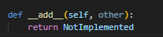
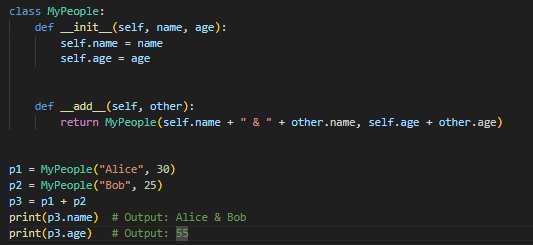
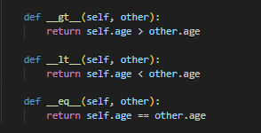

# Tìm hiểu về overator của class trong python

Hôm nay chúng ta sẽ tìm hiểu về cách sử dụng các operator methods của class như +,-,*,/,==. Rất vui là python đã hỗ trợ chúng ta các methods này rồi nên chúng ta chỉ cần overide lại logic là xong.

Mình sẽ đi tìm hiểu một số methods dưới đây:

**1 Add operator:**

Như các bạn đã thấy, python hỗ trợ chúng ta method __add__ ,trong đó tham số đầu tiên là object  hiện tại, tham số thứ 2 là object khác mà chúng ta thực hiện add. Chúng ta có thể xem ví dụ như sau:

Như các bạn thấy, ta có class MyPeople với 2 thuộc tính là name và age. Mình đã custom logic lại hàm __add__ để gộp tên và tuổi của 2 người lại và tạo ra 1 instance mới. Khi chạy thử p3 name sẽ trả về tên gộp lại của p1 và p2, tương tự như age.

**2. Method so sánh** 

Mình sẽ làm các toán tử so sánh như >, <, ==.. như sau:

Như trong hình các bạn thấy, mình đã custom lại method __gt__, hàm này sẽ kiểm tra tuổi của self có lơn hơn other hay không, tương tự như các hàm còn lại.

Kết quả chạy như sau:

Vừa rồi mình đã cho các bạn xem cách sử dụng các method này của python, các bạn sau khi đọc sau có thể tìm hiểu thêm tại đây: [Link](https://www.geeksforgeeks.org/python/operator-overloading-in-python/)

Cảm ơn cách bạn đã đọc bài viết~