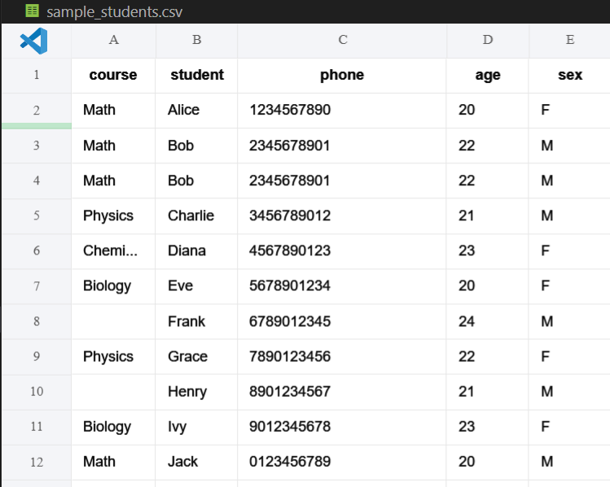

# Các hàm hay dùng để xử lý dữ liệu trong pandas

Hôm nay chúng ta sẽ cùng tìm hiểu về các hàm hay sử dụng để xử lý dữ liệu trong pandas. Việc xử lý dữ liệu trước khi phân tích hay huấn luyện model rất quan trong bởi dữ liệu nếu không được xử lý sẽ gây ra các việc phân tích và phán đoán sai, trong huấn luyện ai thì sẽ gây ra các hiện tại underfit hoặc overfit. 

Dưới đây mình sẽ liệt kê ra các hàm sẽ hay được dùng để xử lý dữ liệu.

Dữ liệu mẫu ban đầu chưa được xử lý.

# 1. Hàm drop_duplicates(Loại bỏ dữ liệu trùng lặp)

Hàm này sẽ được dùng để loại bỏ các dữ liệu trùng lặp giống nhau đi, ở dữ liệu mẫu chúng ta có dòng 3 và 4 đang trùng nhau, sau khi sử dụng hàm này, dòng 4 sẽ được loại bỏ và chỉ giữ lại dòng 3.

Kết quả:

# 2. Hàm dropna (Loại bỏ dữ liệu null)

 

Hàm này sẽ bỏ đi dòng dữ liệu có giá trị null, ở dữ liệu mẫu trên thì ở dòng 8 và 10, cột course đang không có giá trị, khi ta sử dụng thì 2 dòng này sẽ được xóa đi.

Kết quả:

# 3. Hàm drop(Loại bỏ cột)

Ở dữ liệu mẫu trên, giả sử ta thấy cột phone là không cần phải sử dụng trong huấn luyện model, do đó ta sẽ sử dụng hàm drop để bỏ nó đi.

Kết quả:

# 4. Chuyển đổi one-hot coding

Trong huấn luyện model, các giá trị sẽ được sử dụng để huấn luyện là số, do đó các giá trị chuỗi thường không có ý nghĩa trong việc huấn luyện. Giả sử ta thấy ở cột sex, ta có 2 giá trị là **F**(nữ) và **M**(nam), ta có thể chuyển đổi sang giá trị 1, 0 với F là 0 và M là 1 như sau:

Kết quả:

# 5. 1 Số hàm khác

1 số các hàm khác như **fillna, update, add,..** cũng hay được sử dụng, các bạn có thể tìm hiểu thêm để có thể xử lý dữ liệu 1 cách nhanh chóng khi làm việc.

**Link tải file dữ liệu mẫu:** 

[sample_students.csv](imgs/sample_students.csv)